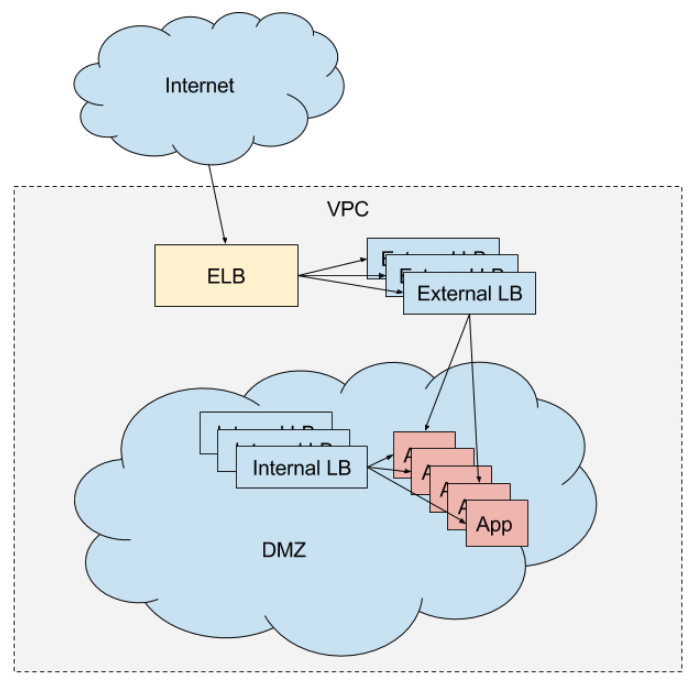

# Install marathon load balancer package in DCOS

The Mesosphere Datacenter Operating System (DCOS) provides useful tooling for service discovery and load balancing. One of the primary tools is Marathon Load Balancer, or `marathon-lb` for short.

Marathon-lb is based on HAProxy, a rapid proxy and load balancer. HAProxy provides proxying and load balancing for TCP and HTTP based applications, with features such as SSL support, HTTP compression, health checking, Lua scripting and more. Marathon-lb subscribes to Marathon’s event bus and updates the HAProxy configuration in real time.

You can can configure marathon-lb with various topologies. Here are some examples of how you might use marathon-lb:

 - Use marathon-lb as your edge load balancer (LB) and service discovery mechanism. You could run marathon-lb on public-facing nodes to route ingress traffic. You would use the IP addresses of your public-facing nodes in the A-records for your internal or external DNS records (depending on your use-case).

 - Use marathon-lb as an internal LB and service discovery mechanism, with a separate HA load balancer for routing public traffic in. For example, you may use an external F5 load balancer on-premise, or an Elastic Load Balancer on Amazon Web Services.

 - Use marathon-lb strictly as an internal LB and service discovery mechanism.

 - You might also want to use a combination of internal and external LBs, with different services exposed on different LBs.

My suggestion is the fourth option above, to highlight the features of marathon-lb.

The architecture of the marathon load balancer is:

The external load balancer will be used for routing external HTTP traffic into the cluster, and the internal LB will be used for internal service discovery and load balancing. If you are doing this on AWS, external traffic will first hit an ELB configured to expose our “public” agent nodes.

## Install external marathon load balancer

Steps to install external marathon load balancer:

- Login dcos management console, and click `Catalog` in navbar.

- Search `marathon-lb` in search bar.

- Choose marathon-lb and click `Review & Run`.

- Set the config for the load balancer. If you want to run more than one instances, change the `instances` to the number of instances you want to set. We suggest set the number equals to the number of public slaves in the cluster, which can reduce the down time when a instance failed.

- Click the button `Review & Run` to review the configuration.

- If you are happy with the configuration, click the button `Run Service` to deploy the service.

## Install internal marathon load balancer

Steps to install internal marathon load balancer:

- Login dcos management console, and click `Catalog` in navbar.

- Search `marathon-lb` in search bar.

- Choose marathon-lb and click `Review & Run`.

- Set the config for the load balancer. 

    - Uncheck the `bind http https`. Because internal load balancer doesn't neet it.

    - Set `haproxy group` to `internal`. Because it is an internal load balancer.

    - If you want to run more than one instances, change the `instances` to the number of instances you want to set. We suggest set the number to 2 or 3, which can reduce the down time when a instance failed.

    - Set the `name` of the load balancer. For example, `marathon-lb-internal`

    - Set the `role`  to `*` to make sure the instances running in private slaves.

- Click the button `Review & Run` to review the configuration.

- If you are happy with the configuration, click the button `Run Service` to deploy the service.

## Reference

- https://mesosphere.com/blog/dcos-marathon-lb/

